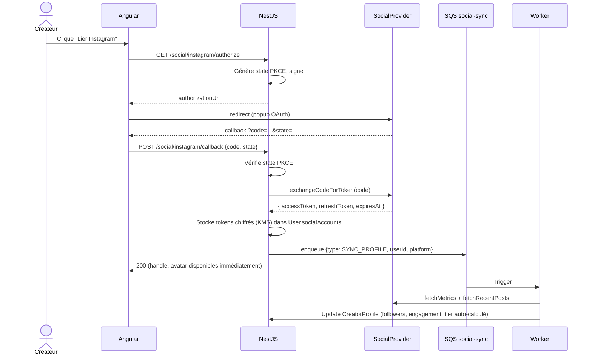

# ADR-011 — Social integrations : Instagram / YouTube / TikTok / Twitter

- **Status** : Accepted
- **Date** : 2026-05-09
- **Deciders** : Solution Architect
- **Tags** : integrations, oauth, social

## Context

PRD §1 + US-017 : INFLU récupère **handle, followers, engagement** depuis Instagram, YouTube, TikTok, Twitter via **OAuth + lecture API** lors de l'inscription créateur (étape 2). Discovery (US-130 → US-132) expose ces metrics côté business avec filtres par plateforme. INFLU Score (post-MVP) consommera ces signaux. Tier d'influence (Nano → Celebrity) calculé depuis followers.

Contraintes :
- Quotas API stricts (Instagram Graph, YouTube Data v3, TikTok for Developers, X API v2 — payante).
- Tokens OAuth doivent être **rafraîchis périodiquement**.
- Dev local doit fonctionner sans clés réelles.
- RGPD : ne stocker que les données nécessaires (NFR GDPR-06).

## Decision

Architecture **abstraction `SocialProvider`** avec 1 implémentation par réseau, **sync asynchrone** via SQS.

### Interface `SocialProvider`

```ts
export interface SocialProvider {
  platform: 'instagram' | 'youtube' | 'tiktok' | 'twitter';
  getAuthorizationUrl(state: string, redirectUri: string): string;
  exchangeCodeForToken(code: string): Promise<SocialTokens>;
  refreshToken(refreshToken: string): Promise<SocialTokens>;
  fetchProfile(accessToken: string): Promise<SocialProfile>;          // handle, displayName, avatar
  fetchMetrics(accessToken: string): Promise<SocialMetrics>;          // followers, engagementRate, postsCount
  fetchRecentPosts(accessToken: string, limit?: number): Promise<SocialPost[]>;
}
```

Implémentations :
- `InstagramProvider` (Instagram Graph API via Meta Login).
- `YoutubeProvider` (Google OAuth + YouTube Data API v3).
- `TiktokProvider` (TikTok for Developers API).
- `TwitterProvider` (X API v2 — niveau Basic payant ; à arbitrer post-MVP).
- `MockSocialProvider` (dev/E2E) : retourne profils synthétiques déterministes par handle.

Sélection runtime : env `SOCIAL_PROVIDERS_MODE=mock|real` + clés par plateforme dans Secrets Manager.

### Workflow OAuth liaison (US-017)



### Sync périodique des metrics

- EventBridge cron quotidien → enqueue `{type: REFRESH_METRICS, userId, platform}` pour chaque compte lié.
- Worker `SocialSyncWorker` :
  - Refresh token si expiré.
  - Fetch metrics + posts.
  - Update DynamoDB.
  - Si erreur quota : retry exponential backoff via SQS DLQ.
  - Si erreur révocation token : mark `socialAccount.status = REVOKED` + notif créateur.

### Tier d'influence (calcul automatique)

| Tier | Followers (max sur tous comptes liés) |
|------|----------------------------------------|
| Nano | 1k–10k |
| Micro | 10k–50k |
| Mid | 50k–500k |
| Macro | 500k–1M |
| Mega | 1M–3M |
| Celebrity | > 3M |

Re-calcul à chaque refresh metrics ; persisté sur `CreatorProfile.tier` pour Discovery GSI1.

### Stockage tokens

- Chiffrés via KMS avec contexte `{userId, platform}`.
- Champs `socialAccounts[]` sur User : `{ platform, handle, accessTokenCiphertext, refreshTokenCiphertext, expiresAt, status, lastSyncedAt }`.
- Pas de tokens dans logs (mask).

## Consequences

**Positives**
- Mock par défaut = inscription créateur fonctionnelle dès dev (US-017 testable E2E sans clés réelles).
- Sync async = pas de blocage UX si quota atteint.
- 1 abstraction commune = ajout TikTok / Twitter sans toucher au métier.
- Tier auto-calculé fiable pour Discovery.

**Négatives**
- Quotas variables par plateforme à monitorer (CloudWatch métriques custom).
- Twitter X API payante → dépendance budget (peut-être skippé MVP).
- Tokens à refresher → job cron + gestion erreurs révocation.
- Données stale entre 2 syncs (cache 24 h) — acceptable pour usage Discovery.

## Alternatives considered

| Alternative | Rejet |
|-------------|-------|
| **Sync inline pendant OAuth callback** | Latence > 5 s (4 API calls), viole NFR PERF. |
| **Polling temps réel (webhook)** | Plateformes limitent ou ne supportent pas (ex. Instagram Graph webhooks limités). |
| **Pas de mock provider** | Inscription créateur impossible en dev. |
| **Service externe (Phyllo, HypeAuditor)** | Coût récurrent, vendor lock-in, perte de contrôle data RGPD. À reconsidérer post-MVP si maintenance providers trop coûteuse. |
| **Stockage tokens en clair** | Violation NFR SEC-02. |
