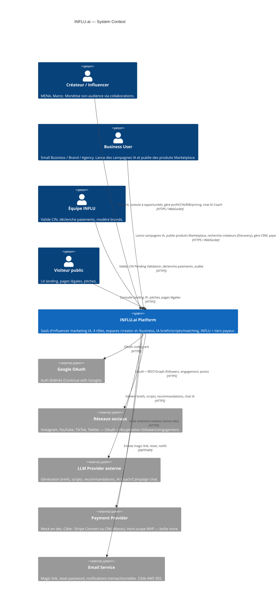
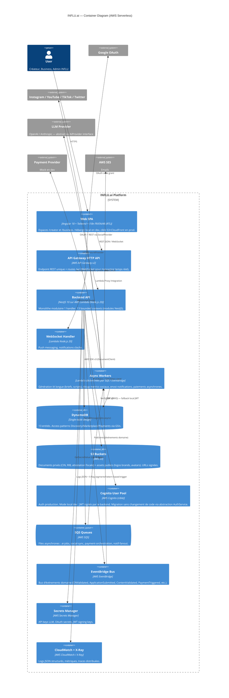
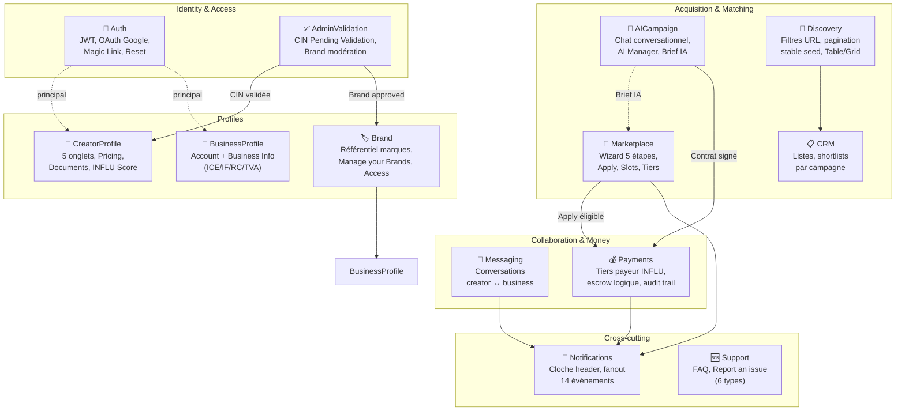
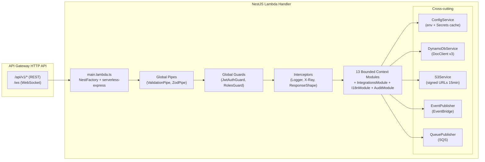
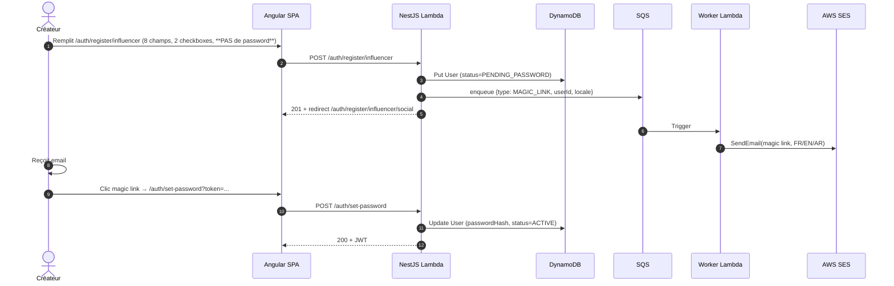
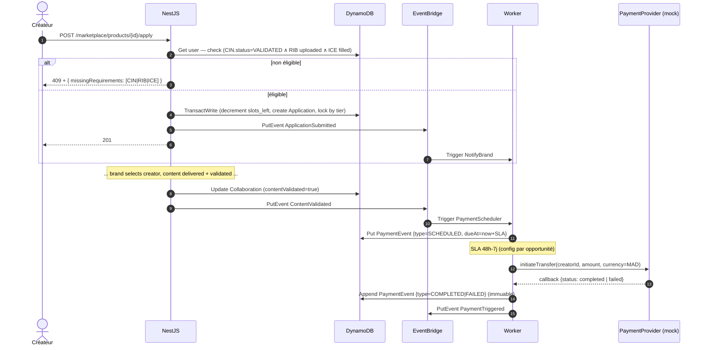
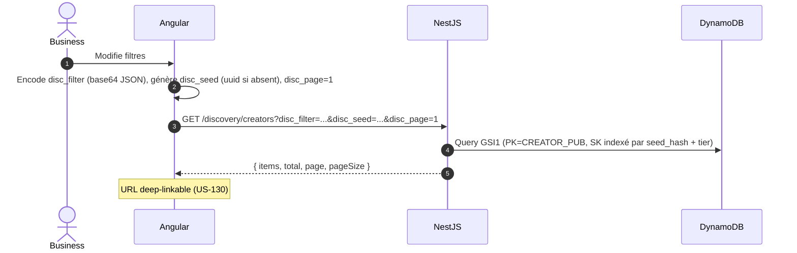
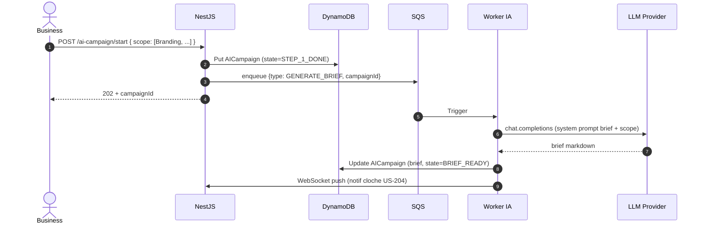
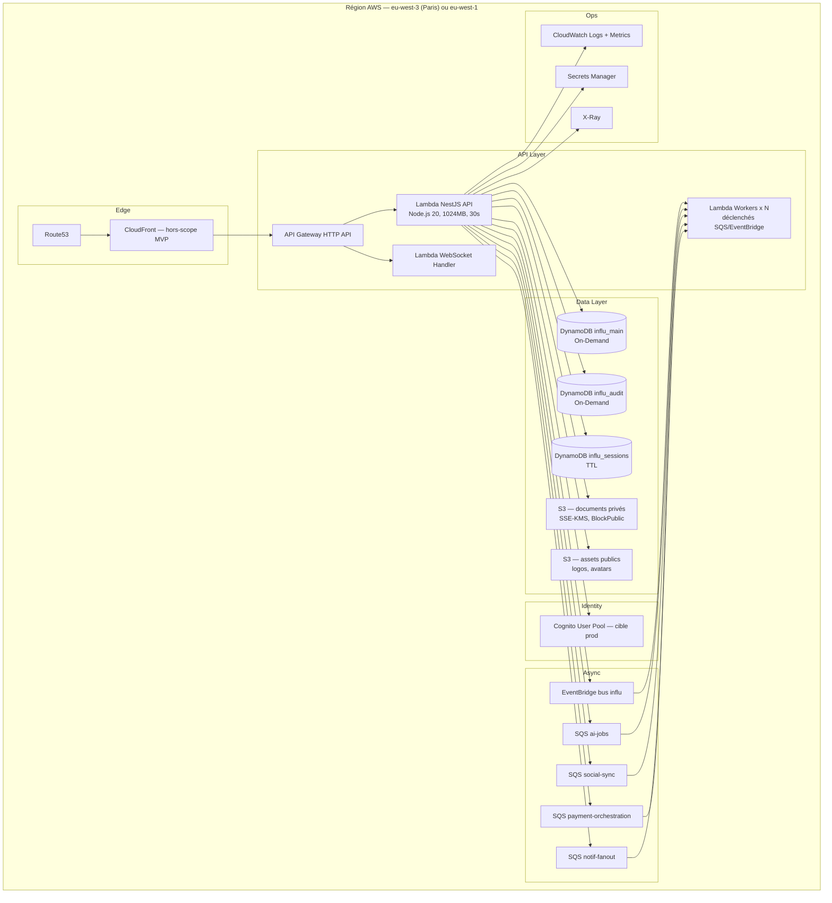

# Solution Architecture — INFLU.ai

> Architecture cible **AWS Serverless** pour la plateforme INFLU.ai (SaaS d'influencer marketing IA région MENA / Maroc).
> Stack : **NestJS (Lambda) + Angular 18 + DynamoDB + Cognito-ready**, packagée en monorepo npm workspaces.
> Toutes les décisions sont traçables au PRD (`docs/01-product-owner/prd.md`) et aux 73 user stories (`docs/01-product-owner/user-stories.md`).

---

## 1. Vision architecturale

INFLU.ai est une plateforme SaaS multi-tenant à 4 rôles (Influencer / Small Business / Brand / Agency) avec INFLU comme **tiers payeur** (escrow logique) et un cœur IA (génération briefs, scripts, recommandations, AI Coach, AI Campaign chat). L'architecture cible :

- **100 % serverless AWS** (Lambda, API Gateway, DynamoDB, S3, SQS, EventBridge, Cognito).
- **Backend NestJS** packagé en bundle Lambda unique (monolithe modulaire), 1 handler API Gateway → routeur NestJS.
- **Frontend Angular 18+** SPA hébergé en local (dev) ; cible production S3 + CloudFront (hors-scope MVP).
- **Découpage par bounded contexts DDD** (13 contextes — voir §4) reflétant la réalité métier : Auth, CreatorProfile, BusinessProfile, Brand, Marketplace, AICampaign, Discovery, CRM, Messaging, Payments, Notifications, Support, AdminValidation.
- **Audit trail immuable** sur les paiements (table `payment_events` append-only) — exigence MVP (INFLU = tiers payeur).
- **i18n FR/EN/AR** (RTL pour l'arabe) bout-en-bout (UI + emails + PDFs Creator Report).
- **Mock providers en dev** : paiements, OAuth réseaux sociaux, LLM — abstractions explicites.

---

## 2. C4 Niveau 1 — Context

---

## 3. C4 Niveau 2 — Containers

---

## 4. Bounded Contexts (Domain-Driven Design)

Le découpage en **13 bounded contexts** est aligné sur les modules NestJS du backend. Chaque contexte = 1 dossier `apps/api/src/modules/<context>` avec son propre `Module`, ses entités, ses services, ses contrôleurs.

### 4.1 Tableau des contextes

| # | Bounded Context | Responsabilités principales | US clés couvertes |
|---|-----------------|------------------------------|-------------------|
| 1 | **Auth** | Login email/password, OAuth Google, magic link créateur, set-password, forgot/reset, logout, RBAC 4 rôles, JWT (local) / Cognito (prod) | US-010 → US-016, US-018, US-201 |
| 2 | **CreatorProfile** | Profil créateur (5 onglets), Pricing, Documents (CIN/RIB/Attestation), Billing, INFLU Score, Creator Report PDF, Delete account | US-041 → US-043, US-070 → US-076 |
| 3 | **BusinessProfile** | Account Info, Business Info (Juridical Form, ICE, IF, RC, TVA, Company Address), Delete account | US-100, US-170, US-174 |
| 4 | **Brand** | Référentiel marques liables (recherche par nom / @ social — pas de création libre), Manage your Brands, Manage/Add access agence | US-171 → US-173 |
| 5 | **Marketplace** | Wizard 5 étapes (Brand Info / Product / Acceptance / Deliverables / Dates), publication produit, slots par tier, hashtags imposés, Apply éligibilité (CIN+RIB+ICE), Expires badge | US-030 → US-035, US-120 → US-122 |
| 6 | **AICampaign** | Chat conversationnel campagne (étape 1 multi-select observée, étapes 2-9 en V2), AI Manager liste, Brief IA généré | US-110 → US-111 |
| 7 | **Discovery** | Recherche créateurs : filtres (platforms / keywords / categories / Range tier / genders / locations) **persistés URL** (`disc_filter`/`disc_seed`/`disc_page`), Table/Grid View, pagination stable seed, profil créateur business | US-130 → US-132 |
| 8 | **CRM** | Listes shortlists (Title + Description), Create New CRM, Add creator to CRM depuis Discovery row actions | US-140 → US-142 |
| 9 | **Messaging** | Conversations creator ↔ business, colonnes (Profile / Campaign / Last Message / Actions), filtres, push WebSocket | US-060 → US-061, US-150 |
| 10 | **Payments** | INFLU = tiers payeur ; escrow logique ; orchestration paiement (Marketplace / Campaign tabs) ; statuts (pending / completed / failed) ; **audit trail immuable** ; SLA 48h–7j post validation contenu | US-160 → US-161 |
| 11 | **Notifications** | Cloche header, fanout WebSocket + persistance, 14 événements (application accepted/refused, brief reçu, content modification requested, deliverable validated, payment received, message, CIN validation, expiring opportunity, AI Coach reco, business-side events) | US-203 → US-204 |
| 12 | **Support** | FAQ accordéon (5 Q standard), Report an issue modale (6 issue types : Bug / Feature request / Performance / UI issue / I have an issue on a campaign / Other), liste "My reports" | US-080 → US-081, US-180 → US-181 |
| 13 | **AdminValidation** | Validation manuelle CIN (queue Pending Validation), modération brands liables, déclenchement paiements (workflow tiers payeur) | Transverse (couvre Risques §7 PRD : engorgement file CIN, conflit accès agence) |

### 4.2 Contextes shared (modules transverses non DDD)

| Module | Rôle |
|--------|------|
| `IntegrationsModule` | Abstractions `AiProvider`, `SocialProvider`, `PaymentProvider`, `EmailProvider` — implémentations multiples (mock dev / réelle prod). |
| `SharedKernel` | Types domaine partagés (Money, Tier d'influence, Locale, Currency=Dhs hardcodée). |
| `I18nModule` | Bundles FR/EN/AR, helper RTL, formatage dates (Maroc dd/MM/yyyy), formatage monnaie Dhs. |
| `AuditModule` | Append-only trail (Payments, AdminValidation, Delete account) — table dédiée DynamoDB. |

---

## 5. C4 Niveau 3 — Components (zoom Backend API)

---

## 6. Flux principaux (séquences)

### 6.1 Inscription créateur + magic link

### 6.2 Apply éligibilité + workflow paiement

### 6.3 Discovery — pagination stable + filtres URL

### 6.4 AI Campaign chat (étape 1 + appel LLM)

---

## 7. Vue données (DynamoDB single-table — synthèse)

> Détaillée dans `adr/ADR-002-database.md`. Synthèse :
> - **1 table** `influ_main` (PK / SK) + **5 GSIs** (GSI1 Discovery, GSI2 ByEmail, GSI3 ByBrand, GSI4 ByStatusDate, GSI5 ByCampaign).
> - **1 table dédiée** `influ_audit` (append-only) pour Payments + AdminValidation + Deletes (immutabilité, exigence tiers payeur).
> - **1 table** `influ_sessions` (TTL natif) pour magic links, reset tokens, refresh tokens.

---

## 8. Vue déploiement (cible)

---

## 9. Traçabilité PRD → Architecture

| Exigence PRD / NFR | Décision architecturale | Artefact |
|---|---|---|
| 4 rôles distincts (P1-P4) | RBAC `RolesGuard` NestJS + claim `role` JWT | Auth context + `ADR-005-auth.md` |
| INFLU = tiers payeur, audit | Table `influ_audit` append-only + EventBridge `PaymentTriggered` | Payments context + `ADR-002-database.md` |
| SLA paiement 48h-7j post-validation | Worker `PaymentScheduler` + `dueAt` calculé + retry SQS | `ADR-010-payments.md` |
| Discovery URL-persistée + seed stable | GSI1 indexé par `seed_hash`, params `disc_*` côté SPA | Discovery context + `ADR-002-database.md` |
| Wizard Marketplace 5 étapes + slots par tier | Validation par étape côté NestJS (Zod + state machine) ; décrément slots via `TransactWrite` | Marketplace context |
| AI Coach + AI Campaign + génération briefs/scripts | Module `IntegrationsModule.AiProvider` + workers async SQS | `ADR-008-ai-integration.md` |
| OAuth réseaux sociaux + récup metrics | `SocialProvider` abstrait, mock dev, refresh asynchrone via SQS `social-sync` | `ADR-011-social-integrations.md` |
| Documents administratifs Maroc (CIN/RIB/ICE/IF/RC/TVA/Attestation fiscale) | Validation typée (regex ICE 15 chiffres), upload S3 SSE-KMS, URLs signées 15 min, validation manuelle CIN via AdminValidation | CreatorProfile + BusinessProfile + `ADR-009-file-storage.md` |
| Devise unique Dhs (MAD) | Type `Money` shared kernel hardcodé MAD ; format i18n Maroc | `ADR-012-i18n-localization.md` |
| Multi-langue FR/EN/AR + RTL | Bundles ngx-translate + dir attribute + emails templates 3 langues | `ADR-012-i18n-localization.md` |
| Empty states & disabled buttons (US-205, US-206) | Codes erreur métier typés côté API (`code` + `messageKey`) consommés par i18n SPA | shared-types package |
| Notifications 14 événements (US-204) | EventBridge → Worker `NotificationFanout` → DynamoDB + WebSocket push | Notifications context |
| Suppression compte (Danger zone, RGPD) | Workflow soft-delete + purge async + audit trail | CreatorProfile / BusinessProfile + `nfr.md` §RGPD |
| Validation CIN manuelle | File `Pending Validation` côté AdminValidation + Cancel Validation côté créateur | AdminValidation context |
| Pic charge campagne / latence Discovery | Lambda autoscale natif, DynamoDB On-Demand, GSI optimisé, pagination keyset | `nfr.md` §Performance |

**Couverture US** : les 73 US (8 vagues) sont couvertes par les 13 bounded contexts (cf. tableau §4.1 colonne "US clés"). Aucune US orpheline.
