# Application Architecture — INFLU.ai

> Architecture applicative dérivée de `docs/02-solution-architect/solution-architecture.md` (13 bounded contexts) et de `stack-decision.md` (NestJS 10 + Angular 18 + DynamoDB + AWS Lambda).
> Source de vérité : 73 user stories (`docs/01-product-owner/user-stories.md`) — couverture 100 %, vérifiable §4 (mapping US → module).

---

## 1. Vue d'ensemble — monorepo npm workspaces

```
INFLU_V16/
├── package.json                   # root workspaces
├── tsconfig.base.json             # strict TS + path aliases
├── apps/
│   ├── api/                       # NestJS 10 (1 Lambda handler)
│   │   └── src/
│   │       ├── main.ts            # bootstrap dev (NestFactory.listen)
│   │       ├── main.lambda.ts     # bootstrap prod (serverless-express)
│   │       ├── app.module.ts      # racine — importe les 13 contexts + cross-cutting
│   │       ├── modules/           # 13 bounded contexts (1 dossier = 1 NestModule)
│   │       │   ├── auth/
│   │       │   ├── creator-profile/
│   │       │   ├── business-profile/
│   │       │   ├── brand/
│   │       │   ├── marketplace/
│   │       │   ├── ai-campaign/
│   │       │   ├── discovery/
│   │       │   ├── crm/
│   │       │   ├── messaging/
│   │       │   ├── payments/
│   │       │   ├── notifications/
│   │       │   ├── support/
│   │       │   └── admin-validation/
│   │       └── shared/            # cross-cutting modules
│   │           ├── config/
│   │           ├── dynamodb/
│   │           ├── storage/        # S3 signed URLs
│   │           ├── ai/             # AiProvider abstraction
│   │           ├── social/         # SocialProvider abstraction (Insta/YT/TT/X)
│   │           ├── email/          # EmailProvider (SES/mailcatcher)
│   │           ├── payment-provider/  # mock + Stripe/CMI
│   │           ├── i18n/
│   │           ├── audit/          # append-only trail
│   │           ├── events/         # EventBridge publisher
│   │           ├── queue/          # SQS publisher
│   │           ├── websocket/      # WS gateway
│   │           └── shared-kernel/  # Money, Tier, Locale, Role enums
└── apps/
    └── web/                       # Angular 18 SPA
        └── src/app/
            ├── app.config.ts      # bootstrapApplication (standalone)
            ├── app.routes.ts      # routing racine — lazy imports par espace
            ├── core/              # interceptors, guards, services transverses
            ├── shared/            # composants UI réutilisables, pipes, directives
            ├── public/            # landing /fr, pitches, légal
            ├── auth/              # login, register, magic link, reset, logout
            ├── creator/           # espace /creator (lazy)
            │   ├── dashboard/
            │   ├── marketplace/
            │   ├── collaborations/
            │   ├── my-account/
            │   ├── ai-coach/
            │   ├── messaging/
            │   ├── account-settings/
            │   └── support/
            ├── business/          # espace /business (lazy)
            │   ├── dashboard/
            │   ├── ai-campaign/
            │   ├── ai-manager/
            │   ├── marketplace/
            │   ├── discovery/
            │   ├── crm/
            │   ├── messaging/
            │   ├── payments/
            │   ├── account-settings/
            │   └── support/
            └── system/            # 403, 404, 500
└── packages/
    └── shared-types/              # types TS générés depuis OpenAPI
```

---

## 2. Backend — modules NestJS (1 module = 1 bounded context SA)

```mermaid
flowchart TB
    AppModule["AppModule (root)"]

    subgraph "Bounded Contexts (13)"
      Auth["AuthModule"]
      CreatorProfile["CreatorProfileModule"]
      BusinessProfile["BusinessProfileModule"]
      BrandM["BrandModule"]
      Marketplace["MarketplaceModule"]
      AICampaign["AiCampaignModule"]
      Discovery["DiscoveryModule"]
      CRM["CrmModule"]
      Messaging["MessagingModule"]
      Payments["PaymentsModule"]
      Notifications["NotificationsModule"]
      Support["SupportModule"]
      AdminValidation["AdminValidationModule"]
    end

    subgraph "Cross-cutting (shared)"
      Config["ConfigModule"]
      DynamoDB["DynamoDbModule"]
      Storage["StorageModule (S3)"]
      AI["AiModule (LLM)"]
      Social["SocialModule (4 providers OAuth)"]
      Email["EmailModule (SES)"]
      PayProv["PaymentProviderModule"]
      I18n["I18nModule"]
      Audit["AuditModule"]
      Events["EventsModule (EventBridge)"]
      Queue["QueueModule (SQS)"]
      WS["WebSocketGateway"]
      Kernel["SharedKernel"]
    end

    AppModule --> Auth & CreatorProfile & BusinessProfile & BrandM & Marketplace & AICampaign & Discovery & CRM & Messaging & Payments & Notifications & Support & AdminValidation
    AppModule --> Config & DynamoDB & Storage & AI & Social & Email & PayProv & I18n & Audit & Events & Queue & WS & Kernel

    Auth --> Email
    Auth --> Social
    CreatorProfile --> Storage
    CreatorProfile --> AdminValidation
    BusinessProfile --> Storage
    BrandM --> BusinessProfile
    Marketplace --> CreatorProfile
    Marketplace --> Payments
    Marketplace --> Notifications
    AICampaign --> AI
    AICampaign --> Queue
    Discovery --> CreatorProfile
    CRM --> Discovery
    Messaging --> WS
    Messaging --> Notifications
    Payments --> PayProv
    Payments --> Audit
    Payments --> Notifications
    Notifications --> WS
    Notifications --> Email
    AdminValidation --> Audit
    AdminValidation --> Notifications
```



### 2.1 Responsabilités par module backend

| Module NestJS | Responsabilité métier | Dépend de |
|---|---|---|
| `AuthModule` | login email/pwd, OAuth Google, magic link, set-password, forgot/reset, logout, JWT, RBAC | EmailModule, SocialModule (Google), DynamoDbModule |
| `CreatorProfileModule` | profil créateur (5 onglets), pricing, documents (CIN/RIB/Attestation), billing (Business/Auto-entrepreneur), INFLU Score, Creator Report PDF, delete account | StorageModule, AdminValidationModule, SocialModule |
| `BusinessProfileModule` | account info + business info (Juridical Form, ICE, IF, RC, TVA, Company Address), delete account | StorageModule |
| `BrandModule` | référentiel marques (recherche par nom / @ social — pas de création libre), Manage your Brands, Manage/Add access agence | BusinessProfileModule |
| `MarketplaceModule` | wizard 5 étapes (Brand Info / Product / Acceptance / Deliverables / Dates), publication, slots par tier, Apply éligibilité (CIN+RIB+ICE), Expires badge | CreatorProfileModule, PaymentsModule, NotificationsModule |
| `AiCampaignModule` | chat conversationnel campagne (étape 1+ multi-select), AI Manager liste, brief IA généré async | AiModule, QueueModule, NotificationsModule |
| `DiscoveryModule` | recherche créateurs avec filtres URL-persistés (`disc_filter` / `disc_seed` / `disc_page`), Table/Grid view, pagination keyset stable | CreatorProfileModule |
| `CrmModule` | listes shortlists (Title + Description), Add creator depuis Discovery row actions | DiscoveryModule |
| `MessagingModule` | conversations creator ↔ business, messages WS push, filtres Search/brand/status | WebSocketGateway, NotificationsModule |
| `PaymentsModule` | tiers payeur INFLU, escrow logique, statuts (pending/completed/failed), tabs Marketplace/Campaign payments, audit trail immuable, SLA 48h-7j | PaymentProviderModule, AuditModule, NotificationsModule |
| `NotificationsModule` | cloche header, fanout 14 événements, persistance + WS push + email digest | WebSocketGateway, EmailModule |
| `SupportModule` | FAQ accordéon (5 Q standard), Report an issue (6 types), liste My reports | NotificationsModule |
| `AdminValidationModule` | validation manuelle CIN (queue Pending Validation), modération brands liables, déclenchement paiements admin | AuditModule, NotificationsModule |

### 2.2 Modules cross-cutting (shared, non-DDD)

| Module | Rôle |
|---|---|
| `ConfigModule` | env vars typées + Secrets Manager cache 5 min |
| `DynamoDbModule` | client `DynamoDBDocumentClient` v3, repositories par entité |
| `StorageModule` | S3 signed URLs PUT/GET 15 min, validations MIME/taille |
| `AiModule` | abstraction `AiProvider` (OpenAI / Anthropic / Bedrock / Mock), orchestrateur cas d'usage, prompts versionnés |
| `SocialModule` | abstraction `SocialProvider` × 4 (Instagram/YouTube/TikTok/Twitter + Mock), OAuth + fetchMetrics |
| `EmailModule` | abstraction `EmailProvider` (SES prod / mailcatcher dev), templates Handlebars + MJML × 3 langues |
| `PaymentProviderModule` | abstraction `PaymentProvider` (Mock dev / Stripe Connect / CMI Maroc) |
| `I18nModule` | `nestjs-i18n` messages erreurs + emails FR/EN/AR, propagation `Accept-Language` |
| `AuditModule` | append-only trail (Payments + AdminValidation + Deletes) sur `influ_audit` |
| `EventsModule` | publisher EventBridge (`PutEvents`) — événements domaine typés |
| `QueueModule` | publisher SQS (`SendMessage`) — files `ai-jobs` / `social-sync` / `payment-orchestration` / `notif-fanout` |
| `WebSocketGateway` | API Gateway WebSocket — push messaging + notifications cloche |
| `SharedKernel` | types domaine partagés (`Money`, `Tier`, `Locale`, `Role`, `Currency=MAD` hardcodée) |

---

## 3. Frontend — feature modules Angular 18

```mermaid
flowchart TB
    AppRoot["app.routes.ts (root)"]

    subgraph "Public (eager)"
      Pub["public.routes.ts<br/>landing /fr · pitches · légal · 404/403/500"]
    end

    subgraph "Auth (eager)"
      AuthF["auth.routes.ts<br/>login · register · magic link · set-pwd · forgot · reset · logout"]
    end

    subgraph "Creator workspace (lazy)"
      CDash["dashboard"]
      CMkt["marketplace + detail"]
      CColl["collaborations"]
      CMyAcc["my-account (5 tabs)"]
      CAi["ai-coach"]
      CMsg["messaging"]
      CSet["account-settings (account/billing/pricing/documents/danger)"]
      CSup["support"]
    end

    subgraph "Business workspace (lazy)"
      BDash["dashboard"]
      BAi["ai-campaign chat"]
      BMan["ai-manager"]
      BMkt["marketplace (wizard 5 steps) + my-marketplace"]
      BDis["discovery (table/grid + filtres URL)"]
      BProf["profile/[id] (4 tabs, sans My INFLU)"]
      BCrm["crm (lists + creators)"]
      BMsg["messaging"]
      BPay["payments (tabs Marketplace/Campaign)"]
      BSet["account-settings (account/brands/danger)"]
      BSup["support"]
    end

    AppRoot --> Pub
    AppRoot --> AuthF
    AppRoot -->|"/creator/* + creatorGuard"| CDash & CMkt & CColl & CMyAcc & CAi & CMsg & CSet & CSup
    AppRoot -->|"/business/* + businessGuard"| BDash & BAi & BMan & BMkt & BDis & BProf & BCrm & BMsg & BPay & BSet & BSup
```



---

## 4. Mapping User Stories → modules

> Couverture 100 % des **73 US**. Toute US a au moins un module backend ET un feature module frontend (sauf transverses pures UI/system).

### 4.1 Pages publiques

| US | Backend module | Frontend feature |
|---|---|---|
| US-001 landing /fr | — (statique CDN) | `public/landing` |
| US-002 pitch créateurs | — | `public/for-influencers` |
| US-003 pitch marques | — | `public/for-brands` |
| US-004 légal brand | — | `public/legal/brand` |
| US-005 légal creator | — | `public/legal/creator` |
| US-006 privacy | — | `public/legal/privacy` |

### 4.2 Auth

| US | Backend module | Frontend feature |
|---|---|---|
| US-010 login email/pwd | `AuthModule` | `auth/login` |
| US-011 Continue with Google | `AuthModule` + `SocialModule` (Google IdP) | `auth/login` |
| US-012 forgot password | `AuthModule` | `auth/forgot-password` |
| US-013 magic link / set password | `AuthModule` + `EmailModule` | `auth/set-password` |
| US-014 logout confirmation | `AuthModule` | `auth/logout` |
| US-015 register role selection | `AuthModule` | `auth/register` |
| US-016 inscription créateur étape 1 | `AuthModule` + `CreatorProfileModule` | `auth/register/influencer` |
| US-017 liaison compte social étape 2 | `AuthModule` + `SocialModule` + `CreatorProfileModule` | `auth/register/influencer/social` |
| US-018 onboarding business | `AuthModule` + `BusinessProfileModule` | `auth/onboard` |

### 4.3 Espace Créateur

| US | Backend module | Frontend feature |
|---|---|---|
| US-020 dashboard 10 KPIs | `CreatorProfileModule` + `MarketplaceModule` + `PaymentsModule` (agrégation) | `creator/dashboard` |
| US-021 tabs Campaigns/Marketplace + filtres | `CreatorProfileModule` + `MarketplaceModule` | `creator/dashboard` |
| US-022 placeholders KPI | — (UI) | `creator/dashboard` |
| US-023 sidebar items disabled | — (UI) | `creator/_layout` |
| US-030 marketplace liste cards | `MarketplaceModule` | `creator/marketplace` |
| US-031 détail opportunité | `MarketplaceModule` | `creator/marketplace/[id]` |
| US-032 Apply bloqué — checklist | `MarketplaceModule` + `CreatorProfileModule` | `creator/marketplace/[id]` |
| US-033 Apply éligible | `MarketplaceModule` (TransactWrite) | `creator/marketplace/[id]` |
| US-034 Paid by INFLU mention | `MarketplaceModule` + `PaymentsModule` | `creator/marketplace/[id]` |
| US-035 badge expiration | `MarketplaceModule` | `creator/marketplace` |
| US-040 collaborations liste | `MarketplaceModule` (vue applications) | `creator/collaborations` |
| US-041 profil créateur header | `CreatorProfileModule` | `creator/my-account` |
| US-042 5 onglets profil | `CreatorProfileModule` + `SocialModule` | `creator/my-account` |
| US-043 Creator Report PDF | `CreatorProfileModule` (puppeteer-core) | `creator/my-account/report` |
| US-050 AI Coach chat | `CreatorProfileModule` + `AiModule` (`chatAiCoach`) | `creator/ai-coach` |
| US-051 Send disabled / Restart | — (UI) | `creator/ai-coach` |
| US-060 messaging colonnes/filtres | `MessagingModule` | `creator/messaging` |
| US-061 messaging empty state | `MessagingModule` | `creator/messaging` |
| US-070 account info créateur | `CreatorProfileModule` | `creator/account-settings/account` |
| US-071 change password | `AuthModule` | `creator/account-settings/account` |
| US-072 billing info ICE search | `CreatorProfileModule` + `BrandModule` (search ICE) | `creator/account-settings/billing` |
| US-073 pricing créateur | `CreatorProfileModule` | `creator/account-settings/pricing` |
| US-074 documents CIN/RIB/Attestation | `CreatorProfileModule` + `StorageModule` + `AdminValidationModule` | `creator/account-settings/documents` |
| US-075 Cancel CIN validation | `CreatorProfileModule` + `AdminValidationModule` | `creator/account-settings/documents` |
| US-076 delete account créateur | `CreatorProfileModule` + `AuditModule` | `creator/account-settings/danger` |
| US-080 support FAQ + reports | `SupportModule` | `creator/support` |
| US-081 Report an issue modale | `SupportModule` | `creator/support` (modal) |

### 4.4 Espace Business

| US | Backend module | Frontend feature |
|---|---|---|
| US-100 dashboard business KPIs | `AiCampaignModule` + `MarketplaceModule` (agrégation) | `business/dashboard` |
| US-101 recherche globale créateur | `DiscoveryModule` (autocomplete) | `business/_layout` (header) |
| US-102 sidebar Social Listening disabled | — (UI) | `business/_layout` |
| US-110 New AI Campaign chat étape 1 | `AiCampaignModule` + `AiModule` | `business/ai-campaign` |
| US-111 AI Manager liste | `AiCampaignModule` | `business/ai-manager` |
| US-120 wizard 5 étapes marketplace | `MarketplaceModule` (state-machine + Zod) | `business/marketplace/create` |
| US-121 deliverables validations | `MarketplaceModule` | `business/marketplace/create` |
| US-122 my marketplace | `MarketplaceModule` | `business/marketplace` |
| US-130 discovery filtres URL | `DiscoveryModule` (GSI1 seed_hash) | `business/discovery` |
| US-131 table/grid + pagination | `DiscoveryModule` | `business/discovery` |
| US-132 profil créateur côté business | `CreatorProfileModule` (vue publique sans My INFLU) | `business/profile/[id]` |
| US-140 CRM liste | `CrmModule` | `business/crm` |
| US-141 create CRM modal | `CrmModule` | `business/crm` |
| US-142 add creator to CRM | `CrmModule` | `business/discovery` (row action) |
| US-150 messaging business | `MessagingModule` | `business/messaging` |
| US-160 payments tabs | `PaymentsModule` | `business/payments` |
| US-161 payments colonnes/empty | `PaymentsModule` | `business/payments` |
| US-170 account settings business | `BusinessProfileModule` | `business/account-settings/account` |
| US-171 manage your brands | `BrandModule` | `business/account-settings/brands` |
| US-172 link new brand (search-only) | `BrandModule` | `business/account-settings/brands` (modal) |
| US-173 manage/add access | `BrandModule` + `AuthModule` (RBAC delegations) | `business/account-settings/brands` |
| US-174 delete account business | `BusinessProfileModule` + `AuditModule` | `business/account-settings/danger` |
| US-180 support business | `SupportModule` | `business/support` |
| US-181 Report an issue business | `SupportModule` | `business/support` (modal) |

### 4.5 États système & layout transverse

| US | Backend module | Frontend feature |
|---|---|---|
| US-200 page 404 | — (catch-all) | `system/not-found` |
| US-201 page 403 | `AuthModule` (RolesGuard) | `system/forbidden` |
| US-202 page 500 | — (filter exception global) | `system/server-error` |
| US-203 header global | — | `core/header` (shared layout) |
| US-204 notifications cloche | `NotificationsModule` + `WebSocketGateway` | `core/header/notifications` |
| US-205 empty states cohérents | — (UI catalog) | `shared/empty-state` |
| US-206 disabled buttons explicites | — (UI catalog) | `shared/disabled-tooltip` |

**Vérification couverture** : 73 / 73 US mappées (cf. `docs/01-product-owner/user-stories.md`).
