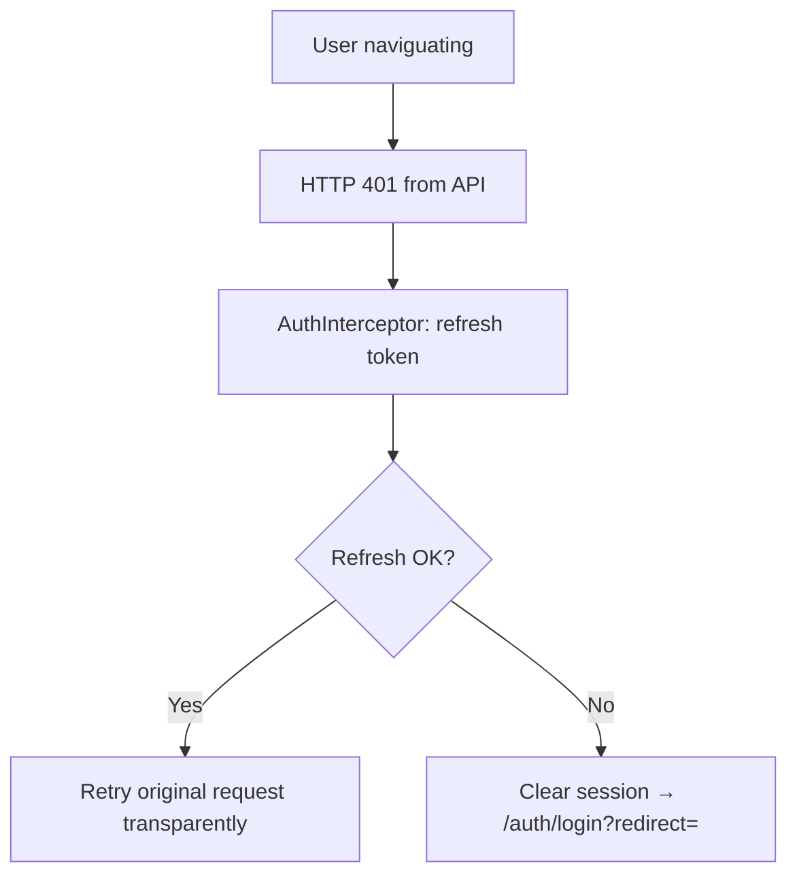

# User Flows — INFLU.ai

> Parcours détaillés par persona avec **chemin nominal**, **erreurs**, **edge cases**.
> Source : `docs/00-orchestration/source-requirement.md` + `docs/01-product-owner/user-stories.md`.

---

## 1. Personas (rappel)

| ID | Persona | Espace |
|----|---------|--------|
| P1 | **Créateur / Influenceur** (MENA, Maroc) | `/creator` |
| P2 | **Business** (Small Business / Brand / Agency) | `/business` |
| P3 | **INFLU Admin** (validation CIN) | `/admin` (interne) |

---

## 2. Persona P1 — Créateur

### 2.1 Flow nominal : `register → onboarding → docs admin → marketplace → apply → submit → paid`

```mermaid
flowchart TD
  A[Visit /fr] --> B[Click 'Inscrivez-vous gratuitement']
  B --> C[/auth/register — 4 cards]
  C --> D[Choose 'I'm an Influencer']
  D --> E[/auth/register/influencer — Step 1: Personal info]
  E -->|Email, Gender, Full name, Country=Morocco, Phone +212, City, Address, 2 checkboxes| F{Form valid?}
  F -->|No| E1[Inline errors per field]
  F -->|Yes| G[Step 2: Assign social account]
  G -->|Link Instagram / TikTok / YouTube / Twitter| H[Account created — magic link sent to email]
  H --> I[Email: 'Set your password' link]
  I --> J[/auth/reset-password — set initial password]
  J --> K[/creator — Dashboard with empty KPIs]
  K --> L{All admin docs ready?}
  L -->|No| M[/creator/accounts — complete Address/Phone/Gender, choose Business or Auto-entrepreneur, ICE]
  M --> N[/creator/accounts?acc_tab=documents]
  N --> N1[Submit CIN number + date of expiry → status 'Pending Validation']
  N --> N2[Upload RIB file]
  N --> N3[Upload Attestation if Business]
  N --> O[/creator/accounts?acc_tab=billing — Set pricing per account/format]
  L -->|Yes| P[/creator/marketplace — grid of opportunity cards]
  O --> P
  P --> Q[Click on opportunity card]
  Q --> R[/creator/marketplace/:id — full detail]
  R --> S{Profile complete?}
  S -->|No| S1[Block 'Complete your profile to apply' + checklist + Apply DISABLED]
  S -->|Yes| T[Apply ENABLED — 'Paid by INFLU' visible]
  T --> U[Click Apply → application sent → slot reserved]
  U --> V[Brand selects creator → notification]
  V --> W[/creator/collaborations — deal active]
  W --> X[Receive brief + AI script via Messaging]
  X --> Y[Date Reception: prepare content → Submit]
  Y --> Z[Brand validates content]
  Z --> AA[Date Publication: publish on social with imposed hashtags + tagged @brand]
  AA --> AB[INFLU triggers payment 48h-7 days after validation]
  AB --> AC[Dashboard: Pending Payments → Revenue Generated updated, INFLU Score recalculated]
```

### 2.2 Edge cases & erreurs créateur

| ID | Cas | Trigger | UX response |
|----|-----|---------|-------------|
| EC-C1 | **CIN refusée par admin** | Admin clique Reject | Email + notification cloche : « Your CIN was rejected. [Reason]. Please resubmit. » + badge `Rejected` rouge sur Documents tab + bouton « Resubmit » re-active le form |
| EC-C2 | **CIN expirée** | Date d'expiry < aujourd'hui | Badge `Expired` rouge + alert « Your CIN has expired — submit a new one to apply. » + Apply bloqué |
| EC-C3 | **Slot épuisé pendant Apply** | Race condition : autre créateur a pris le dernier slot | Toast erreur « Sorry, this opportunity is full. » + carte basculée en `Expired` + redirect liste |
| EC-C4 | **Apply sur opportunité Expired** | User a une vieille URL bookmarkée | Détail montre badge `Expired` + bouton remplacé par texte « Applications closed » |
| EC-C5 | **Magic link expiré** | User clique > 24h après réception | Page `/auth/reset-password` avec message « Link expired — request a new one » + lien `/auth/forgot-password` |
| EC-C6 | **Téléphone hors +212** | User colle un numéro étranger | Validator regex `^\+212\d{9}$` → erreur « Format attendu : +212 suivi de 9 chiffres » |
| EC-C7 | **ICE invalide** | User saisit < 15 chiffres | Bouton Search disabled tant que < 15 ; après Search sans résultat → « ICE not found in INFLU database » |
| EC-C8 | **RIB upload échoue (taille / format)** | Fichier > 5MB ou pas PDF/JPG | Toast erreur « File too large (max 5MB) » ou « Format not supported (PDF/JPG only) » |
| EC-C9 | **Cancel Validation pendant Pending** | Click sur « Cancel Validation » | Confirm dialog « Cancel CIN validation? You'll need to resubmit. » → Cancel/Confirm |
| EC-C10 | **Suppression compte** | Click « Delete my account » | Confirm dialog avec warning EXACT : *« Deleting your account will permanently remove your profile, campaigns, and billing information. This action cannot be undone. »* + double confirmation (taper son email) |
| EC-C11 | **Session expirée** | Token expiré pendant navigation | Interceptor 401 → tente refresh → si KO redirige `/auth/login?redirect=<currentUrl>` |
| EC-C12 | **AI Coach Restart** | User click Restart pendant conversation | Confirm dialog « Restart conversation? All progress will be lost. » → Confirm vide la conversation |

---

## 3. Persona P2 — Business (Agency / Brand / Small Business)

### 3.1 Flow nominal : `register → link brand → create marketplace product (5-step wizard) OR AI Campaign chat → discovery → CRM → messaging → payment`

```mermaid
flowchart TD
  A[/auth/register — 4 cards] --> B{Choose role}
  B -->|Small Business| C
  B -->|Brand| C
  B -->|Agency| C
  C[/auth/onboard — Account Information + Business Information]
  C -->|Juridical Form, ICE, Company Name, IF, RC, TVA| D[/business — Dashboard]
  D --> E[/business/accounts?acc_tab=brands]
  E --> F[Click 'Link new brand']
  F --> G[Modal: search brand by name or @social]
  G --> H{Brand found?}
  H -->|No| H1[No results — try another search]
  H -->|Yes| I[Confirm selection → brand linked]
  I --> J{Path A or B?}
  J -->|Marketplace product| K[/business/marketplace/create — Wizard 5 steps]
  J -->|AI Campaign| L[/business/ai-campaign — chat IA]

  K --> K1[A. Brand Information: select brand + description]
  K1 --> K2[B. Product Details: name, description, requested content, mini script]
  K2 --> K3[C. Acceptance criteria: list of free-text criteria]
  K3 --> K4[D. Deliverables: platform, content type, quantity ≥ 1, unit price MAD, tagged @account]
  K4 --> K5[E. Dates: Date Reception + Date Publication per deliverable]
  K5 --> K6[Publish → visible on /creator/marketplace]

  L --> L1[Q1: 'What kind of campaign... what scope?']
  L1 --> L2[Multi-select: Branding/Visibility/Positioning/Launch/Promotions/Event/Engagement]
  L2 --> L3[Brief generated → next steps: profiles reco, scripts, matching, contract]

  K6 --> M[/business/discovery — find creators]
  L3 --> M
  M --> M1[Filters: platforms, keywords, categories, Range tier, gender, location]
  M1 --> M2[URL: ?disc_filter=...&disc_seed=...&disc_page=1]
  M2 --> M3[Table View / Grid View toggle]
  M3 --> N[Click creator → /business/profile/:id]
  N --> O{Action?}
  O -->|Add to CRM| P[/business/crm — pick or create list]
  O -->|Send message| Q[/business/messagerie — start conversation]
  P --> P1[Modal Create new CRM if first time: Title + Description → Create CRM]
  Q --> Q1[Negotiate, send brief, validate deliverables]
  Q1 --> R[Creator submits content → Business validates → INFLU triggers payment]
  R --> S[/business/payments — track Marketplace + Campaign payments]
```

### 3.2 Edge cases & erreurs business

| ID | Cas | Trigger | UX response |
|----|-----|---------|-------------|
| EC-B1 | **Wizard étape D incomplète** | User saisit Quantity = 0 | Erreur inline « Quantity must be ≥ 1 » + bouton « Specify dates » disabled |
| EC-B2 | **Wizard sans deliverable** | User clique Next sans avoir ajouté de livraison | Bouton Next disabled + help text « Add a deliverable to continue » |
| EC-B3 | **Wizard step navigation back/forward** | User va Previous puis Next | Données conservées en state local (signal) — pas de re-fetch |
| EC-B4 | **Tagged account sans @** | User tape « brandname » sans @ | Préfixe `@` figé visuellement, validator rejette si pas regex `^@[a-zA-Z0-9._]{2,30}$` |
| EC-B5 | **Brand introuvable** | Search dans modal Link new brand sans résultat | « No brand found. Contact INFLU to add your brand to our database. » (pas de création libre) |
| EC-B6 | **CRM create sans title** | Submit form modal vide | Erreurs inline « Title required », « Description required », bouton Create CRM disabled |
| EC-B7 | **Discovery pagination overflow** | URL `?disc_page=999` mais Y=49 | Redirect vers `disc_page=49` + toast info « Page out of range, redirected to last page » |
| EC-B8 | **Filtre URL corrompu** | `disc_filter=invalid` | Catch silencieux : reset au filtre par défaut + log analytique |
| EC-B9 | **Audience insights tab clicked** | Tab disabled | Pas de navigation, tooltip « Coming soon — requires more data » |
| EC-B10 | **AI Campaign sans réponse Q1** | User ne sélectionne aucune option | Send disabled + help « Select at least one option » |
| EC-B11 | **Payment row click pour détail** | Liste paiements | Drawer right slide avec détails (creator, brand, amount breakdown, dates, status timeline) |
| EC-B12 | **Manage access / Add access** | Click sur brand row action | Modal liste membres + invite by email — un membre = un email + rôle (Owner/Editor/Viewer) |
| EC-B13 | **Suppression compte business** | Click « Delete my account » | Idem créateur — warning EXACT + double confirmation. Si Agency avec marques liées : alert supplémentaire « X brands will be unlinked » |
| EC-B14 | **Report an issue** | Floating button bottom-right | Modal avec Issue type select REQUIRED (6 options EXACTES), Title, Description, Cancel / Submit report |

---

## 4. Persona P3 — INFLU Admin (validation CIN)

### 4.1 Flow nominal

```mermaid
flowchart TD
  A[Admin login] --> B[/admin/cin-validation-queue]
  B --> C[List of CIN submissions: Status = Pending Validation]
  C --> D[Click row → Drawer with CIN number, expiry date, scan, creator info]
  D --> E{Decision?}
  E -->|Approve| F[Mark CIN as Validated → creator notified, Apply unblocked]
  E -->|Reject| G[Required reason: Format invalide / Document illisible / Identité non concordante / Autre]
  G --> H[Notify creator: email + cloche + badge Rejected on Documents tab]
```

### 4.2 Edge cases admin

| ID | Cas | UX response |
|----|-----|-------------|
| EC-A1 | **Liste vide** | Empty state « No pending CIN validations 🎉 » |
| EC-A2 | **Concurrent validation** | 2 admins ouvrent le même CIN — second voit toast « Already processed by another admin » et drawer ferme |
| EC-A3 | **Reject sans raison** | Bouton Reject disabled tant qu'aucune raison sélectionnée |

---

## 5. Flows transverses

### 5.1 Auth — Forgot password

```mermaid
flowchart TD
  A[/auth/login] --> B[Click 'Forgot your password?']
  B --> C[/auth/forgot-password — Email input + Submit]
  C --> D[Email sent → /auth/magic-link-sent confirmation page]
  D --> E[User opens email → click link]
  E --> F[/auth/reset-password?token=... — New password + Confirm + Submit]
  F --> G[/auth/login — toast 'Password updated, sign in']
```

Erreurs :
- Email inconnu → message générique « If this email exists, a reset link has been sent » (sécurité, pas d'énumération)
- Token expiré → message « Link expired — request a new one » + lien retour `/auth/forgot-password`

### 5.2 Auth — Login

```mermaid
flowchart TD
  A[/auth/login] --> B{Provider?}
  B -->|Email + Password| C[Submit]
  B -->|Continue with Google| D[OAuth flow]
  C --> E{Credentials valid?}
  E -->|No| E1[Toast 'Invalid email or password']
  E -->|Yes| F{User role?}
  F -->|Influencer| G[/creator]
  F -->|Business| H[/business]
  D --> F
```

### 5.3 Logout

```mermaid
flowchart TD
  A[Header avatar → Logout] --> B[/auth/logout — 'Are you sure you want to logout?']
  B --> C{Confirm?}
  C -->|Cancel| D[Back to previous page]
  C -->|Logout| E[Clear session → /auth/login]
```

### 5.4 États système

```mermaid
flowchart TD
  A[Any URL] --> B{Match route?}
  B -->|No| C[/404.html]
  B -->|Yes, but role mismatch| D[/403.html]
  B -->|Yes, server 5xx| E[/error-generic.html]
  B -->|Yes, OK| F[Render page]
```

### 5.5 Session expirée



---

## 6. Couverture des 73 US

Toutes les US (US-001 → US-206) sont couvertes par au moins un flow ci-dessus. Le mapping détaillé US ↔ wireframe est dans `wireframes-manifest.json`.

| Wave | US range | Flow principal |
|------|----------|----------------|
| 1 | US-001 → US-016 | Public + Auth (signup/login) |
| 2 | US-017, US-018 | Onboarding |
| 3 | US-020 → US-076, US-100 → US-102, US-170 → US-174, US-203 | Dashboards + Account settings + Sidebar |
| 4 | US-030 → US-051, US-101, US-130 → US-132 | Marketplace browse + Discovery + AI Coach |
| 5 | US-033, US-040, US-110 → US-122 | Apply + Wizard Marketplace + AI Campaign |
| 6 | US-060, US-061, US-140 → US-150 | Messaging + CRM |
| 7 | US-160, US-161, US-204 | Payments + Notifications |
| 8 | US-080, US-081, US-180, US-181, US-200 → US-206 | Support + États système |
