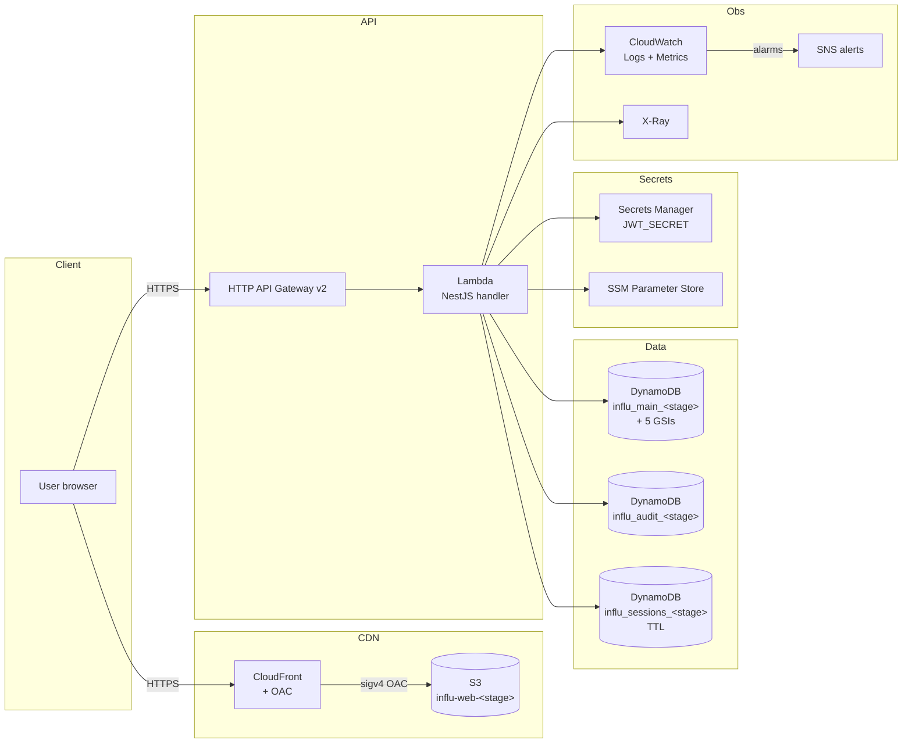

# 01 — Overview

## 1. Target architecture

## 2. Environments

| Env | Stack | Branch / trigger | Protection |
|---|---|---|---|
| `dev` | `influ-dev` | push to `develop` | sandbox, table delete allowed |
| `staging` | `influ-staging` | tag `staging-*` or workflow_dispatch | PITR + tables Retain |
| `prod` | `influ-prod` | tag `v*` or workflow_dispatch (requires reviewers) | DeletionProtection + tables Retain |

## 3. Region

**`eu-west-3` (Paris)** — required by:

- **GDPR**: EU data residency for personal data of EU users.
- **Loi 09-08 (Maroc, CNDP)**: Moroccan personal data ideally stored in EU/Adequate jurisdiction (cf. ADR-002).
- ACM certs for CloudFront are exceptionally requested in **us-east-1** (CloudFront constraint, see [07-manual-aws-console-steps.md](07-manual-aws-console-steps.md)).

## 4. Cost estimate (order of magnitude, MVP traffic)

| Component | Assumption | Est. monthly USD |
|---|---|---|
| Lambda | 5 M req/m, 200 ms p50, 1024 MB arm64 | $12 |
| API Gateway HTTP | 5 M req/m | $5 |
| DynamoDB on-demand | 5 M WCU + 20 M RCU + 5 GSIs | $35–60 |
| CloudFront | 100 GB egress | $10 |
| S3 | 5 GB + minimal requests | $1 |
| CloudWatch | 5 GB logs ingest | $3 |
| Secrets Manager | 3 secrets | $1.20 |
| X-Ray | 1 M traces | $1 |
| **Total** | | **~$70–90** |

Reassess if writes pass 1 M/day (cf. ADR-002 — switch to provisioned).

## 5. Compliance

- **At rest**: KMS encryption on all 3 DynamoDB tables, AES-256 on S3.
- **In transit**: TLS 1.2+ enforced via CloudFront `MinimumProtocolVersion`.
- **PITR**: enabled on all 3 tables (35-day rollback).
- **Audit retention**: `influ_audit_*` table has `DeletionPolicy: Retain` regardless of stage; PITR + future S3 archive (Object Lock 10y per ADR-009).
- **Secrets**: never stored in env, only Secrets Manager ARNs are passed to Lambda.
- **No long-term AWS creds in GitHub**: OIDC-only.

## 6. SLOs (cf. `docs/02-solution-architect/nfr.md`)

| SLO | Target | Monitoring |
|---|---|---|
| API availability | 99.5 % (MVP) | CloudWatch `4xx/5xx` + SNS alarm |
| API latency p99 | < 3 s | CloudWatch `Latency p99` alarm |
| Lambda errors | < 1 % | CloudWatch `Errors` alarm |
